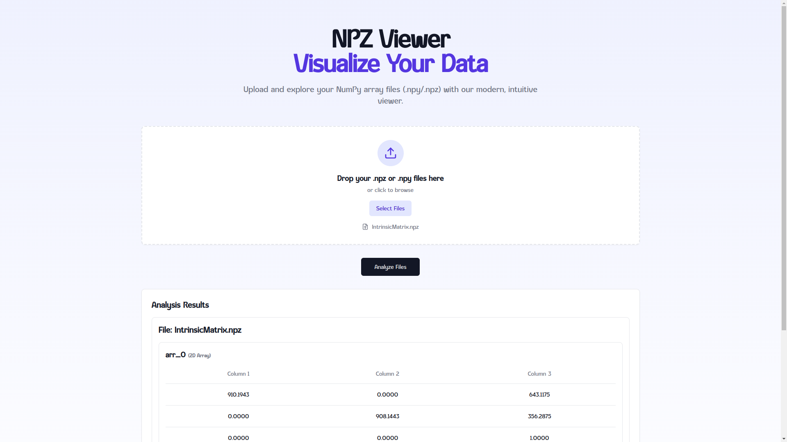
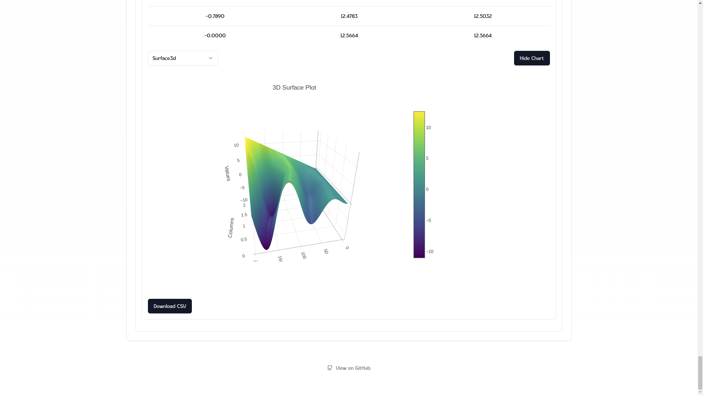
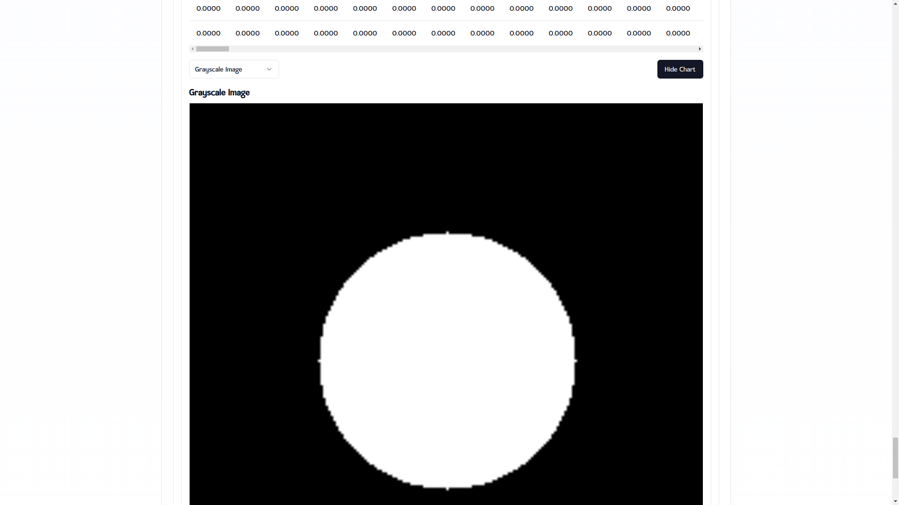
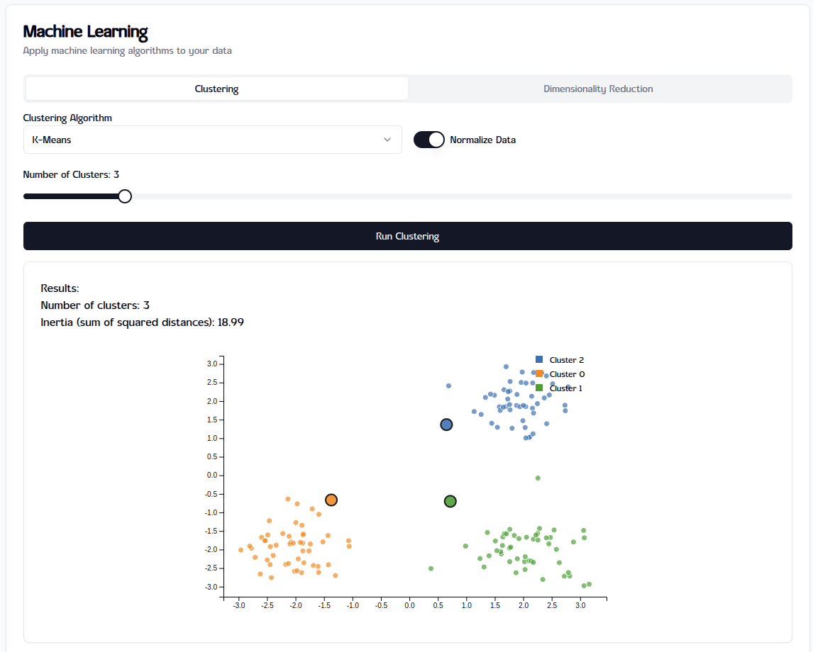
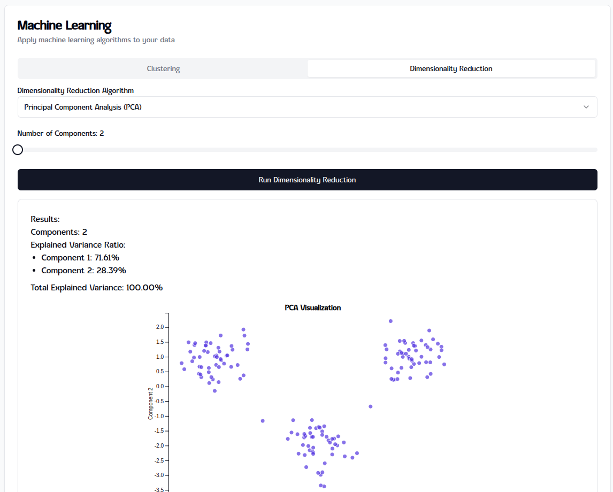
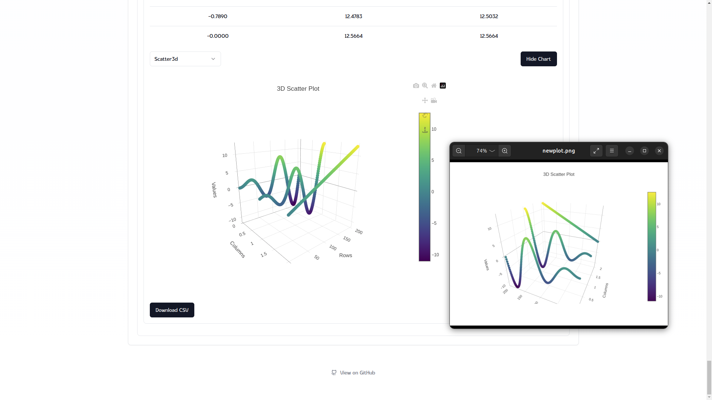

# 📊 NPZ/NPY Web Viewer 🌐

Welcome to the **NPZ/NPY Web Viewer**, a modern, feature-rich tool designed for interactive visualization and exploration of `.npz` and `.npy` files.


---

## 🌟 Features

### 🔍 **File Support**

- Upload `.npz` or `.npy` files to visualize multidimensional arrays directly in your browser.
- Handles multiple arrays in a single `.npz` file seamlessly.

### 📈 **Multiple Visualization Options**

- View arrays with multiple chart types:
  - 🟠 **3D Scatter Plot**
  - 🟢 **3D Surface Plot**
  - 🔵 **Scatter Plot**
  - 🔗 **Line Chart**
  - ⚪ **Grayscale Image**
- Switch between chart types interactively for deeper insights.

### 🧠 **Machine Learning Integration**

- Apply machine learning algorithms directly to your data:
  - **Clustering**:
    - K-means clustering with customizable number of clusters
    - DBSCAN clustering with adjustable epsilon and minimum samples
  - **Dimensionality Reduction**:
    - Principal Component Analysis (PCA) with selectable components
- Interactive visualizations of ML results with detailed metrics
- Normalize data option for better algorithm performance

### 💾 **Save & Download**

- **Download CSV**: Convert arrays into `.csv` files for easy sharing and analysis.
- **Save 3D Plots**: Export interactive 3D plots for use in presentations or reports.

### 🎛 **Interactive Interface**

- Intuitive dropdowns for selecting chart types.
- Dynamic resizing and rendering for smooth user experience.

### ⚡ **Fast and Efficient**

- Powered by **Next.js** with React for a seamless UI.
- All processing happens client-side — no backend required.

---

## 🛠️ Installation and Setup

### Prerequisites

- Node.js >= 18.x
- Docker (optional)

### Setup

1. Clone the repository:

   ```bash
   git clone https://github.com/<your-username>/npz-web-viewer.git
   cd npz-web-viewer/npz_viewer_client
   ```

2. Install dependencies:

   ```bash
   npm install
   ```

3. Start the development server:

   ```bash
   npm run dev
   ```

4. Access the app in your browser:
   ```
   http://localhost:3000
   ```

---

## 🎨 Screenshots

### 📊 Interactive Graphs




### 🧠 Machine Learning Features




### 💾 Download Options



---

## 🚀 Docker

### Using Docker Compose

To run both the backend and the frontend services together:

1. **Navigate to the Project Root:**

   ```bash
   cd /path/to/your/project
   ```

2. **Run the Services:**
   Use the following command to start the backend and frontend:

   ```bash
   docker-compose up
   ```

   This will:

   - Build the frontend Docker image.
   - Start the service and expose it on:
     - **Frontend**: [http://localhost:3000](http://localhost:3000)

---

### Running in Detached Mode

If you want the services to run in the background:

```bash
docker-compose up -d
```

---

---

## 📦 Features in Action

### 🌟 Upload and Explore Files

- View any `.npz` or `.npy` file effortlessly.

### 🔧 Transform and Analyze

- Switch between visualization modes:
  - 3D Scatter, 3D Surface, Line Chart, and more!

### 🧠 Apply Machine Learning

- Cluster your data with K-means or DBSCAN
- Reduce dimensions with PCA
- Visualize results with interactive plots
- Adjust algorithm parameters in real-time

### 💾 Save and Share

- Export data as `.csv` or save interactive plots for offline use.

---

## 🧑‍💻 Contributing

We welcome contributions! Feel free to fork the repo and submit pull requests to improve this project.

---

## 📜 License

This project is licensed under the **BSD 3-Clause**. See the [LICENSE](LICENSE) file for details.

---

### 🌐 Check it out live [here](https://npz-web-viewer.vercel.app)
